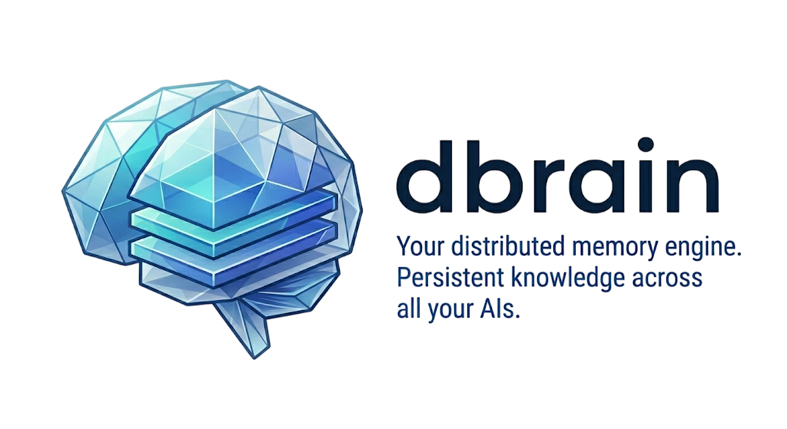

<p align="center">
  
</p>

<p align="center">
  <a href="https://www.npmjs.com/package/dbrain"></a>
  <a href="LICENSE"></a>
  <a href="https://nodejs.org"></a>
</p>

---

Every AI conversation starts from zero. Switch machines, switch apps, and your AI forgets everything. **dbrain** fixes that.

Install it once, connect every AI you use — Claude Code at home, Claude Code at work, Gemini on your phone. All share the same identity, the same memories, the same knowledge.

```
[Home]   Claude Code ──MCP──┐
[Work]   Claude Code ──MCP──┤     ┌─────────────────────────────────┐
[Mobile] Gemini ──REST──────┼────→│  dbrain (your mind)             │
[Server] OpenClaw ──REST────┤     │  identity + memory + knowledge. │
[Other]  Custom AI ──API────┘     └─────────────────────────────────┘
```

Not an AI agent. Not an assistant. Not a model. **Just memory** — structured, searchable, persistent.

## Quick Start

```bash
npm install -g dbrain
dbrain init       # interactive wizard — creates DB, config, identity
dbrain start      # starts API on :7878 + dashboard on :7879
```

Then connect Claude Code from any machine:

```bash
dbrain connect claude
```

The wizard asks for the brain URL and token (shown during `init`):

```
┌  dbrain — Connect to a brain
│
◇  Brain URL
│  http://localhost:7878
│
◇  Access token
│  sk-dbr_...
│
◇  Brain found
│
●  Brain: dBrain — 2 entities, 0 facts
│
◇  Claude Code configured
│
◇  Files updated ──────────────────────────────────────────────╮
│                                                              │
│  ~/.claude.json          MCP server registered               │
│  ~/.claude/settings.json  Permissions granted                │
│  ~/.claude/CLAUDE.md      Behavioral instructions installed  │
│                                                              │
├──────────────────────────────────────────────────────────────╯
│
└  Connected. Restart Claude Code to activate.
```

Restart Claude Code and it will start using the brain. You can also skip the wizard:

```bash
dbrain connect claude http://your-server:7878 --token=sk-dbr_...
```

## Docker

```bash
git clone https://github.com/ivncmp/dbrain.git
cd dbrain
cp .env.example .env    # edit token, names, port
docker compose up -d
```

Then from any client machine:

```bash
dbrain connect claude http://your-server:7878
```

## How It Works

The brain has 4 layers:

| Layer             | What                                                  | How                                                  |
| ----------------- | ----------------------------------------------------- | ---------------------------------------------------- |
| **Identity**      | Who is the AI? Who is the user? How should it behave? | `documents` table                                    |
| **Conversations** | Raw chat history from every AI session                | `conversations` + `messages` tables                  |
| **Knowledge**     | Structured facts organized by PARA                    | `entities` + `facts` tables with hot/warm/cold tiers |
| **Recall**        | Full-text search over all facts                       | FTS5 with OR logic for multi-language queries        |

### Memory Tiers

Memories fade if you don't use them — like a real brain.

| Tier     | Rule                                              |
| -------- | ------------------------------------------------- |
| **hot**  | Accessed in the last 7 days, or accessCount >= 10 |
| **warm** | 8–30 days since last access                       |
| **cold** | > 30 days — fading, candidate for archival        |

Every search bumps accessed facts back to hot. The brain stays sharp on what matters.

## MCP Tools

Available to any MCP client (Claude Code, etc.):

| Tool            | Purpose                                     |
| --------------- | ------------------------------------------- |
| `recall`        | Search memory + get identity (primary tool) |
| `remember`      | Save a fact to an entity                    |
| `get_entity`    | Read entity with all its facts              |
| `list_entities` | List entities by category or type           |
| `create_entity` | Create a new entity                         |
| `bump`          | Touch a memory to keep it hot               |
| `log`           | Send conversation messages for storage      |
| `wake_up`       | Full identity load                          |
| `overview`      | Brain stats                                 |

## REST API

All endpoints require `Authorization: Bearer <token>` except `/health`.

| Method            | Endpoint              | Purpose                                        |
| ----------------- | --------------------- | ---------------------------------------------- |
| `GET`             | `/health`             | Brain pulse                                    |
| `GET`             | `/connect`            | Client config (MCP, permissions, instructions) |
| `GET/PUT/DELETE`  | `/workspace/:key`     | Identity documents                             |
| `GET/POST/DELETE` | `/entities/:id`       | Knowledge entities                             |
| `POST`            | `/entities/:id/facts` | Add facts to an entity                         |
| `PATCH`           | `/facts/:id/access`   | Bump a memory (keep it hot)                    |
| `GET/POST`        | `/conversations`      | Chat history                                   |
| `POST`            | `/search`             | Full-text search over all facts                |
| `GET`             | `/memory/summary`     | Overview: entities x tiers                     |

## CLI Commands

| Command                | Where  | Purpose                                   |
| ---------------------- | ------ | ----------------------------------------- |
| `dbrain init [path]`   | Server | Create a new brain (DB, config, identity) |
| `dbrain start [path]`  | Server | Start the API server + dashboard          |
| `dbrain connect <client> [url]` | Client | Connect a client to a running brain |
| `dbrain status [path]` | Server | Check brain status                        |

`init` runs on the **server** (creates the brain). `connect` runs on the **client** (configures Claude Code). The brain serves its own client config via `GET /connect`.

## Dashboard

Web dashboard on port `7879`. Shows brain stats, entities with PARA categories, fact tiers, conversations, and full-text search. Single-file React app — no build step.

## Stack

| Layer      | Technology                                 |
| ---------- | ------------------------------------------ |
| Language   | Node.js + TypeScript                       |
| API        | Fastify                                    |
| DB         | SQLite + FTS5 (better-sqlite3)             |
| MCP        | @modelcontextprotocol/sdk (HTTP transport) |
| Validation | Zod                                        |
| CLI        | @clack/prompts                             |
| Dashboard  | React 18 (CDN, no build step)              |

## Development

```bash
git clone https://github.com/ivncmp/dbrain.git
cd dbrain
npm install              # installs deps + builds (prepare script)
npx dbrain init          # create a brain (only needed once)
npm run dev              # starts the server with file watching
```

| Script               | What it does                             |
| -------------------- | ---------------------------------------- |
| `npm run dev`        | Dev server with file watching (tsx)      |
| `npm run build`      | Compile TypeScript + copy dashboard HTML |
| `npm start`          | Start the compiled server from `dist/`   |
| `npm test`           | Run tests with vitest                    |
| `npm run lint`       | ESLint check                             |
| `npm run lint:fix`   | ESLint auto-fix                          |
| `npm run format`     | Prettier format                          |
| `npm run check`      | Lint + format + build (full pipeline)    |

## Environment Variables

For non-interactive setup (Docker, CI):

| Variable            | Default        | Purpose          |
| ------------------- | -------------- | ---------------- |
| `DBRAIN_DATA`       | `~/.dbrain`    | Data path        |
| `DBRAIN_PORT`       | `7878`         | API port         |
| `DBRAIN_HOST`       | `0.0.0.0`      | Bind address     |
| `DBRAIN_TOKEN`      | Auto-generated | Access token     |
| `DBRAIN_AGENT_NAME` | `dBrain`       | AI identity name |
| `DBRAIN_OWNER_NAME` | `Human`        | Owner name       |
| `DBRAIN_TIMEZONE`   | Auto-detected  | Owner timezone   |

## License

[MIT](LICENSE)